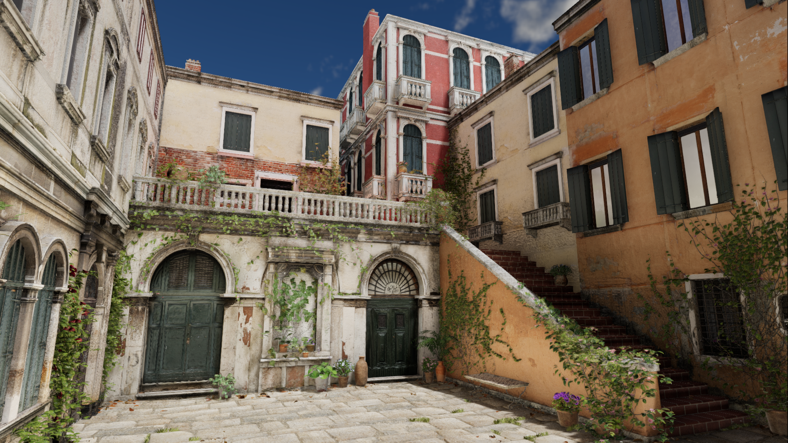
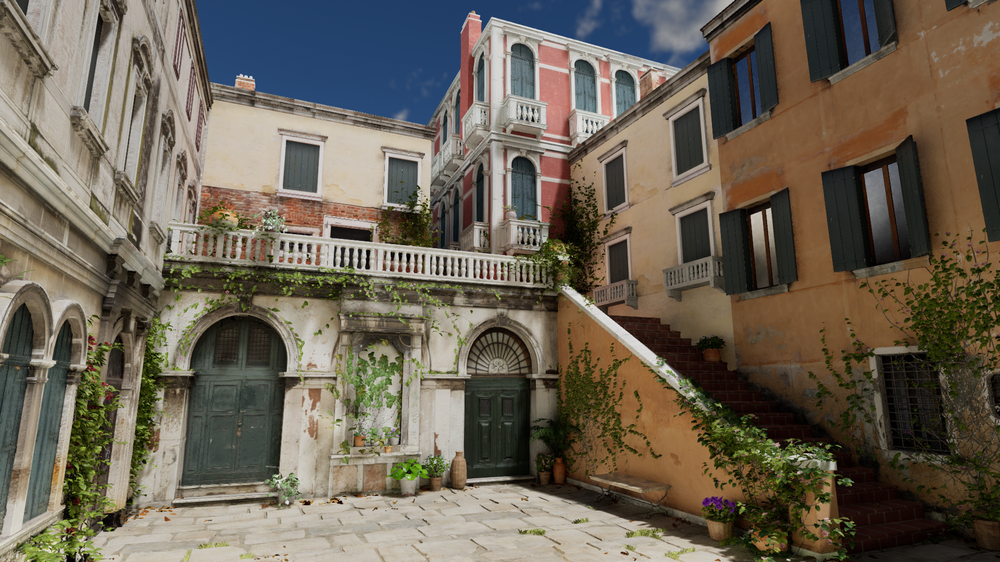
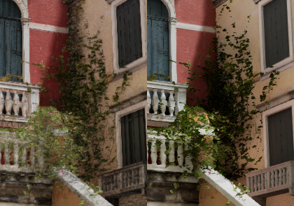
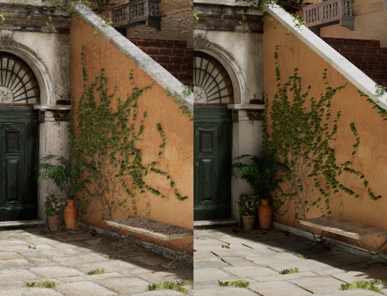

# Godot 4 SDFGI vs Unreal 5 Lumen Comparison

I have attempted to set up the same scene in Godot 4 and Unreal 5 in order to compare their two global illumination systems: SDFGI and Lumen. Lumen is running the non-raytraced version, as Godot's SDFGI does not yet support ray tracing.

* Both renders are tonemapped with ACES. How close the curves between the two engines is unknown, they were matched visually through exposure setting adjustments.
* This scene in comparison has a single directional light pointing downwards at a slight angle.
* Ambient light is not enabled. Not even from the skybox.
* The indirect lighting intensity/energy for the directional light is increased 7x the direct lighting intensity, which significantly brightens the areas in shadow.
* Godot offers a screen space global illumination supplement called SSIL which can run in tandem with SDFGI. This was not enabled for the comparison.

What I'll ask you to ignore in this comparison, as it's irrelevant:
* **Texture/Normal Map Detail**: Yes, the Unreal screenshot's textures are missing a lot of detail, especially the textures at a distance. This is likely due to a difference in anisotropic filtering implementation. While Godot looks more detailed from a screenshot comparison, it also has more aliasing noise when moving around in game.
* **Anti-Aliasing**: Both engines are using FXAA, as that's the only algorithm they have in common for these settings. I would use MSAA, however Unreal does not support it with their deferred rendering pipeline.
* **Specular Highlights**: Unreal handles direct lighting differently from Godot; it's hard for me to quantify. The top of the red building in the Unreal screenshot being brighter is due to a difference in specular handling.

## **Comparison #1**

Godot 4

Unreal 5

### Shadows

Godot's SDFGI appears to retain darker shadows in small detailed areas such as the under-side of these ledges. Unreal is creating shadows in these areas, but Lumen is brightening them almost completely in this scenario.

[Left: Godot 4, Right: Unreal Engine 5]

Lumen has a tendency to create dark blotches in areas with complex geometry such as the center this plant that's climbing the wall. You can find examples of dark blotchy spots all over the Unreal screenshots. Godot's result looks more natural in this case, as the lighting across the area is more even.

[Left: Godot 4, Right: Unreal Engine 5]

The cast shadow from this stairway wall in Unreal is notably darker than the Godot counterpart. How accurate either is to photorealism is difficult to say. Though, having a much darker shadow than the wall that's casting the shadow looks unnatural to me. This may be caused by a difference in how the indirect lighting energy is calculated.

[Left: Godot 4, Right: Unreal Engine 5]

## **Overall Impressions**

### **Godot 4 SDFGI:**

Pros:
* Seems to keep more natural/even lighting tones across the image.
* Works especially well in corners and small detailed areas.
* Does not create noise.
* In comparison to non-raytraced Lumen specifically, the reflections are more detailed and give a better illusion of real reflections.

Mids:
* While the reflections are fairly detailed for a non-raytraced system, they really need to be used in combination with PBR textures that slightly blur/hide them as they do not look good as a pure mirror.

Cons:
* Transition between cascade resolutions can be visible and distracting when the camera is moving in some lighting scenarios (such as most of the image in shadow).

### **Unreal 5 Lumen:**

Pros:
* The effect looks stable when the camera is in motion. If there is cascade resolution switching, I am not noticing it.

Mids:
* Non-raytraced Lumen reflections are not detailed, but at the same time they are temporally stable and not distracting. Their effect could be desirable or not depending on the game.

Cons:
* Many areas in shadow have noise that flickers and can be very distracting, especially when the camera is not moving.
* It seems to freak out sometimes in areas with highly detailed geometry, especially in corners. Making it too dark or sometimes picking random bright color values that should not be there.

## [THIS DOCUMENT IS A WORK IN PROGRESS]

TODO: Light bleeding comparison  
TODO: Reflection comparison  
TODO: Show issue with random colors in corners in Lumen  
TODO: Strong reflected light comparison
